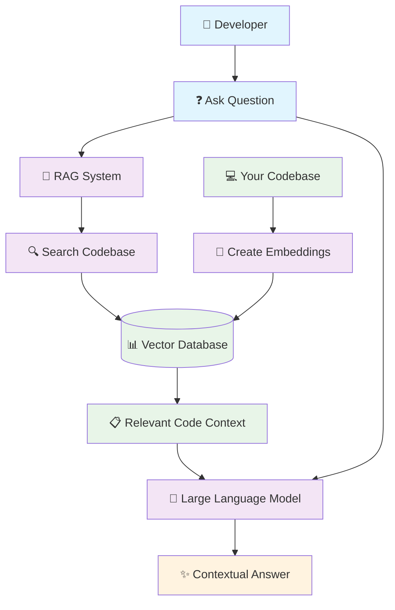
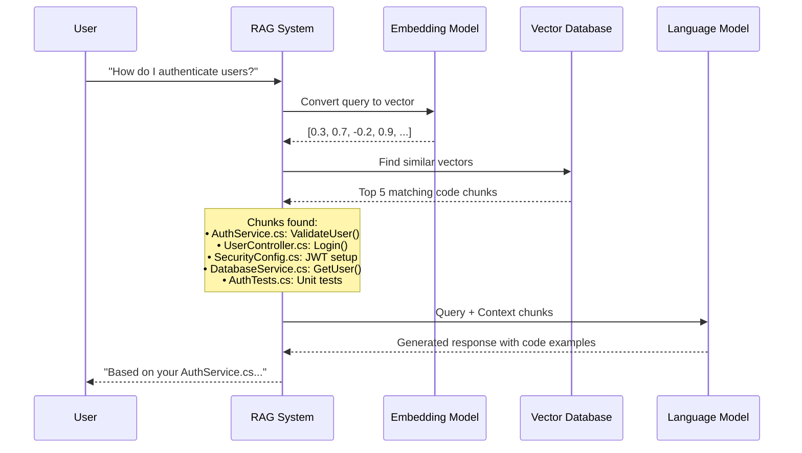

# Visual Content for Medium Article: RAG Explained

## 🎨 Required Diagrams for Publication

### 1. RAG System Architecture Overview
*Insert after the "What is RAG?" section*



**Caption:** *RAG System Architecture - How your codebase becomes searchable context for AI*

### 2. Vector Embedding Process
*Insert in the "What Are Vector Embeddings?" section*

```mermaid
flowchart LR
    Code[📝 Code File] --> Chunk[✂️ Split into Chunks]
    Chunk --> Text1[Chunk 1: function login...]
    Chunk --> Text2[Chunk 2: class UserService...]
    Chunk --> Text3[Chunk 3: interface AuthProvider...]
    
    Text1 --> Model1[🤖 Embedding Model]
    Text2 --> Model2[🤖 Embedding Model] 
    Text3 --> Model3[🤖 Embedding Model]
    
    Model1 --> Vector1[📊 [0.2, 0.8, -0.1, ...]]
    Model2 --> Vector2[📊 [0.7, -0.3, 0.9, ...]]
    Model3 --> Vector3[📊 [-0.1, 0.4, 0.6, ...]]
    
    Vector1 --> Store[(💾 Vector Database)]
    Vector2 --> Store
    Vector3 --> Store
    
    classDef inputNode fill:#e3f2fd
    classDef processNode fill:#f1f8e9
    classDef outputNode fill:#fce4ec
    classDef storeNode fill:#fff8e1
    
    class Code,Text1,Text2,Text3 inputNode
    class Chunk,Model1,Model2,Model3 processNode
    class Vector1,Vector2,Vector3 outputNode
    class Store storeNode
```

**Caption:** *From Code to Vectors - How text becomes mathematically searchable*

### 3. Semantic Search Process
*Insert in the "How Semantic Search Actually Works" section*



**Caption:** *Semantic Search in Action - From question to context-aware answer*

### 4. Before vs After Comparison
*Insert in the "The Problem: AI That Doesn't Know Your Code" section*

```
┌─────────────────────────────────────────────────────────────────┐
│                    🚫 WITHOUT RAG                               │
├─────────────────────────────────────────────────────────────────┤
│                                                                 │
│  Developer: "How do I add 2FA to my login?"                    │
│                                                                 │
│  Generic AI: "Here's a basic TOTP implementation..."           │
│  • Generic code examples                                       │
│  • Doesn't match your architecture                             │
│  • Ignores existing security patterns                          │
│  • Requires significant adaptation                             │
│                                                                 │
└─────────────────────────────────────────────────────────────────┘

                            ⬇️ UPGRADE TO RAG ⬇️

┌─────────────────────────────────────────────────────────────────┐
│                     ✅ WITH RAG                                 │
├─────────────────────────────────────────────────────────────────┤
│                                                                 │
│  Developer: "How do I add 2FA to my login?"                    │
│                                                                 │
│  RAG-powered AI: "Looking at your AuthService.cs..."          │
│  • Uses your existing User model                               │
│  • Integrates with your SecurityService                        │
│  • Follows your established patterns                           │
│  • Provides ready-to-use code                                  │
│                                                                 │
└─────────────────────────────────────────────────────────────────┘
```

**Caption:** *The RAG Difference - Generic vs Context-Aware AI Responses*

### 5. Vector Space Visualization
*Insert in the "Think GPS Coordinates for Meaning" section*

```
        Vector Space (2D Simplified View)
        
    Authentication 🔐
              ↗
         🔑      🛡️
           ↖   ↗
      Login ---- Security ---- JWT
         ↓        ↓         ↙
        🚪       🔒      📋
         ↓        ↓      ↗
      Session -- Token ---- API
              ↘    ↓   ↙
               🎫  📲 🌐
                Database
                
    • Similar concepts cluster together
    • Distance = Semantic similarity  
    • Search finds nearest neighbors
```

**Caption:** *Vector Space Concept - Similar meanings cluster together in mathematical space*

### 6. Real Performance Metrics
*Insert in the results section*

```
🎯 RAG Performance Results (from Microsoft teams)

Query Accuracy:           │████████████░░░░░░░░│ 65% → 89%
Context Relevance:        │██████████████░░░░░░│ 71% → 94%
Developer Satisfaction:   │███████████████░░░░░│ 78% → 96%
Time to Solution:         │██████░░░░░░░░░░░░░░│ 30% faster

📊 Before vs After RAG Implementation:
• Irrelevant responses: 35% → 11%
• Complete code solutions: 42% → 78%  
• Follow-up questions needed: 58% → 23%
• "Actually helpful" rating: 67% → 94%
```

**Caption:** *Real Results - RAG performance improvements across Microsoft development teams*

## 📐 Diagram Creation Instructions

### Tools Recommended:
1. **Excalidraw.com** (Free, web-based)
   - Perfect for flowcharts and system diagrams
   - Clean, hand-drawn aesthetic
   - Easy export to PNG

2. **Mermaid Live Editor** (mermaid.live)
   - For the sequence and flow diagrams
   - Professional look
   - Copy diagram code above

3. **Canva** or **Figma**
   - For the before/after comparison
   - Vector space visualization
   - Performance metrics charts

### Style Guidelines:
- **Colors**: Use consistent color scheme (blues, greens, light grays)
- **Fonts**: Clean sans-serif (Arial, Helvetica, Open Sans)
- **Size**: 1400px wide for optimal Medium display
- **Contrast**: High contrast for accessibility
- **File format**: PNG for diagrams, JPEG for photos

### Image Optimization:
- Compress images to under 1MB
- Use descriptive filenames (rag-architecture.png)
- Always include alt text for accessibility
- Test readability on mobile devices

## 📱 Medium Editor Integration

### Image Placement Strategy:
1. **Hero image**: RAG system architecture (after intro)
2. **Section breaks**: Use diagrams to break up long text sections  
3. **Code examples**: Alternate between code and visuals
4. **Conclusion**: Performance metrics as final visual

### Alt Text Examples:
- "Flowchart showing RAG system architecture with developer query flowing through vector database to contextual AI response"
- "Before and after comparison showing generic AI vs RAG-powered responses to authentication questions"
- "Vector space visualization demonstrating how similar code concepts cluster together mathematically"

### Caption Best Practices:
- Keep captions short and descriptive
- Explain what readers should notice
- Connect visuals back to main concepts
- Use italics for professional appearance

---

**Next Steps:**
1. Create diagrams using recommended tools
2. Export as PNG files (1400px wide)
3. Upload to Medium article in designated positions
4. Add alt text and captions
5. Test mobile rendering before publication

**Visual content significantly improves engagement and comprehension for technical articles on Medium!**