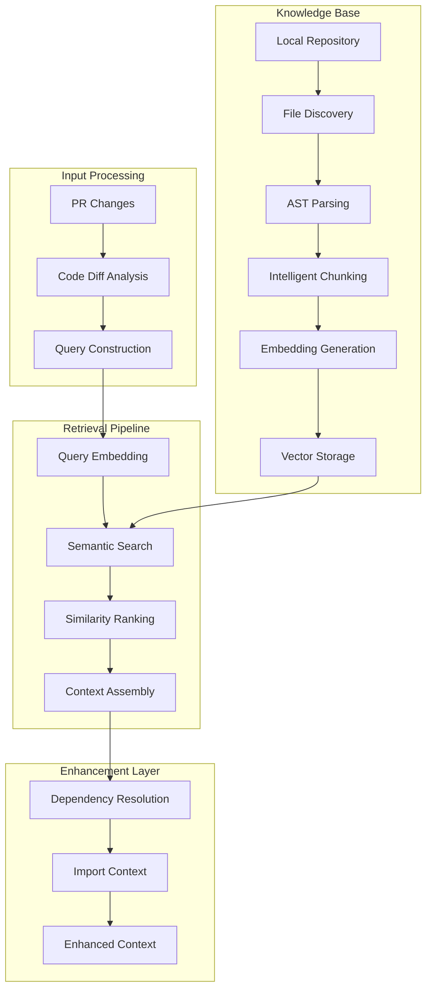

# RAG Deep Dive: Advanced Retrieval-Augmented Generation for Code Intelligence

*A comprehensive technical guide to implementing production-ready RAG systems for large codebases*

## Table of Contents

1. [RAG Architecture Fundamentals](#rag-architecture-fundamentals)
2. [Embedding Strategy for Code](#embedding-strategy-for-code)
3. [Intelligent Chunking Algorithms](#intelligent-chunking-algorithms)
4. [Vector Storage and Retrieval](#vector-storage-and-retrieval)
5. [Semantic Search Implementation](#semantic-search-implementation)
6. [Repository Indexing Strategies](#repository-indexing-strategies)
7. [Performance Optimization](#performance-optimization)
8. [Cost Management](#cost-management)
9. [Real-World Challenges and Solutions](#real-world-challenges-and-solutions)

---

## RAG Architecture Fundamentals

### What Makes Code RAG Different?

Traditional RAG systems work with documents, but code has unique characteristics:

- **Syntax Dependencies**: Code blocks depend on imports, class definitions, and method signatures
- **Hierarchical Structure**: Files → Classes → Methods → Variables
- **Cross-References**: Functions call other functions across multiple files  
- **Language-Specific Patterns**: Each programming language has distinct syntax and conventions
- **Version Evolution**: Code changes frequently, requiring incremental updates

### Multi-Modal RAG Architecture



## Embedding Strategy for Code

### Code-Optimized Embedding Models

Different embedding models perform differently on code vs. natural language:

| **Model** | **Dimension** | **Code Performance** | **Cost** | **Best For** |
|-----------|---------------|---------------------|----------|--------------|
| `text-embedding-ada-002` | 1536 | ⭐⭐⭐ | Low | General code |
| `text-embedding-3-small` | 1536 | ⭐⭐⭐⭐ | Low | Balanced performance |
| `text-embedding-3-large` | 3072 | ⭐⭐⭐⭐⭐ | High | Maximum accuracy |
| `code-search-ada-code-001` | 768 | ⭐⭐⭐⭐ | Medium | Code-specific (deprecated) |

### Implementation: Multi-Level Embedding

```csharp
public class CodeEmbeddingService
{
    private readonly IEmbeddingGenerator<string, Embedding<float>> _embeddingGenerator;
    private readonly ILogger<CodeEmbeddingService> _logger;

    public async Task<CodeChunk> CreateEnhancedChunk(
        string code, 
        string filePath, 
        int startLine, 
        int endLine)
    {
        // Level 1: Raw Code Embedding
        var codeEmbedding = await _embeddingGenerator.GenerateAsync(code);
        
        // Level 2: Code + Context Embedding
        var contextualCode = EnhanceWithContext(code, filePath);
        var contextualEmbedding = await _embeddingGenerator.GenerateAsync(contextualCode);
        
        // Level 3: Semantic Summary Embedding
        var summary = ExtractSemanticSummary(code, filePath);
        var summaryEmbedding = await _embeddingGenerator.GenerateAsync(summary);
        
        return new EnhancedCodeChunk
        {
            Content = code,
            FilePath = filePath,
            StartLine = startLine,
            EndLine = endLine,
            
            // Multiple embeddings for different search strategies
            CodeEmbedding = codeEmbedding.Vector.ToArray(),
            ContextualEmbedding = contextualEmbedding.Vector.ToArray(),
            SummaryEmbedding = summaryEmbedding.Vector.ToArray(),
            
            // Metadata for enhanced retrieval
            Language = DetectLanguage(filePath),
            CodeType = ClassifyCodeType(code),
            Complexity = CalculateComplexity(code),
            Dependencies = ExtractDependencies(code, filePath)
        };
    }
    
    private string EnhanceWithContext(string code, string filePath)
    {
        var context = new StringBuilder();
        
        // Add file context
        context.AppendLine($"// File: {filePath}");
        
        // Add language context
        var language = DetectLanguage(filePath);
        context.AppendLine($"// Language: {language}");
        
        // Add structural context
        var codeType = ClassifyCodeType(code);
        context.AppendLine($"// Type: {codeType}");
        
        // Add the actual code
        context.AppendLine(code);
        
        return context.ToString();
    }
    
    private string ExtractSemanticSummary(string code, string filePath)
    {
        var summary = new List<string>();
        
        // Extract key elements based on language
        var language = DetectLanguage(filePath);
        
        switch (language.ToLower())
        {
            case "csharp":
                summary.AddRange(ExtractCSharpElements(code));
                break;
            case "java":
                summary.AddRange(ExtractJavaElements(code));
                break;
            case "python":
                summary.AddRange(ExtractPythonElements(code));
                break;
        }
        
        return string.Join(" ", summary);
    }
}
```

## Intelligent Chunking Algorithms

### Problem: Naive Line-Based Chunking Breaks Context

```csharp
// ❌ BAD: Breaks in middle of method
public class UserService 
{
    private readonly IDbContext _context;
    
    public async Task<User> GetUserAsync(int id)
    {
        // CHUNK BOUNDARY HERE - BREAKS CONTEXT
        var user = await _context.Users
            .Include(u => u.Roles)
            .FirstOrDefaultAsync(u => u.Id == id);
            
        return user;
    }
}
```

### Solution: AST-Aware Semantic Chunking

```csharp
public class SemanticChunkingService
{
    public List<CodeChunk> ChunkBySyntaxTree(string code, string filePath)
    {
        var chunks = new List<CodeChunk>();
        var language = DetectLanguage(filePath);
        
        switch (language.ToLower())
        {
            case "csharp":
                return ChunkCSharpCode(code, filePath);
            case "java":
                return ChunkJavaCode(code, filePath);
            case "python":
                return ChunkPythonCode(code, filePath);
            default:
                return ChunkByLines(code, filePath); // Fallback
        }
    }
    
    private List<CodeChunk> ChunkCSharpCode(string code, string filePath)
    {
        var chunks = new List<CodeChunk>();
        
        try
        {
            var syntaxTree = CSharpSyntaxTree.ParseText(code);
            var root = syntaxTree.GetRoot();
            
            // Strategy 1: Class-level chunks
            var classes = root.DescendantNodes().OfType<ClassDeclarationSyntax>();
            foreach (var classDecl in classes)
            {
                var classCode = classDecl.ToFullString();
                if (classCode.Length > 2000) // Large class, break into methods
                {
                    chunks.AddRange(ChunkLargeClass(classDecl, filePath));
                }
                else
                {
                    chunks.Add(CreateChunk(classCode, classDecl, filePath));
                }
            }
            
            // Strategy 2: Method-level chunks for large classes
            var methods = root.DescendantNodes().OfType<MethodDeclarationSyntax>();
            foreach (var method in methods)
            {
                if (method.Body?.Statements.Count > 20) // Complex method
                {
                    chunks.Add(CreateMethodChunk(method, filePath));
                }
            }
            
            // Strategy 3: Interface and enum chunks
            var interfaces = root.DescendantNodes().OfType<InterfaceDeclarationSyntax>();
            foreach (var iface in interfaces)
            {
                chunks.Add(CreateChunk(iface.ToFullString(), iface, filePath));
            }
            
            return chunks;
        }
        catch (Exception ex)
        {
            _logger.LogWarning(ex, "Failed to parse C# syntax tree for {FilePath}, falling back to line chunking", filePath);
            return ChunkByLines(code, filePath);
        }
    }
    
    private CodeChunk CreateChunk(string code, SyntaxNode node, string filePath)
    {
        var span = node.GetLocation().GetLineSpan();
        
        return new CodeChunk
        {
            Content = code,
            FilePath = filePath,
            StartLine = span.StartLinePosition.Line + 1,
            EndLine = span.EndLinePosition.Line + 1,
            ChunkType = GetSyntaxNodeType(node),
            Metadata = $"{filePath}:L{span.StartLinePosition.Line + 1}-L{span.EndLinePosition.Line + 1}",
            
            // Semantic information
            Identifier = ExtractIdentifier(node),
            Dependencies = ExtractNodeDependencies(node),
            Complexity = CalculateNodeComplexity(node)
        };
    }
}

// Enhanced CodeChunk with semantic information
public class EnhancedCodeChunk : CodeChunk
{
    public string Language { get; set; } = string.Empty;
    public string ChunkType { get; set; } = string.Empty; // "class", "method", "interface"
    public string Identifier { get; set; } = string.Empty; // Class/method name
    public List<string> Dependencies { get; set; } = new();
    public int Complexity { get; set; }
    public float[] CodeEmbedding { get; set; } = Array.Empty<float>();
    public float[] ContextualEmbedding { get; set; } = Array.Empty<float>();
    public float[] SummaryEmbedding { get; set; } = Array.Empty<float>();
}
```

## Vector Storage and Retrieval

### In-Memory vs Persistent Storage Comparison

| **Aspect** | **In-Memory** | **SQLite + VSS** | **Redis + Vector** | **Pinecone/Weaviate** |
|------------|---------------|-------------------|--------------------|--------------------|
| **Speed** | ⚡ Fastest | 🐌 Slow | ⚡ Fast | 🌐 Network dependent |
| **Persistence** | ❌ Lost on restart | ✅ Persistent | ⚡ Configurable | ✅ Persistent |
| **Scalability** | 📉 Memory limited | 📈 Disk limited | 📈 RAM + Disk | 📈 Cloud scale |
| **Cost** | 💰 Free | 💰 Free | 💰 Redis hosting | 💰 SaaS pricing |
| **Setup** | ✅ Zero config | ⚙️ Schema setup | ⚙️ Redis + modules | 🌐 API keys |

### Implementation: SQLite Vector Storage

```csharp
public class SqliteVectorStore : IVectorStore
{
    private readonly string _connectionString;
    private readonly ILogger<SqliteVectorStore> _logger;

    public async Task<int> IndexRepositoryAsync(string repositoryId, List<EnhancedCodeChunk> chunks)
    {
        using var connection = new SqliteConnection(_connectionString);
        await connection.OpenAsync();

        // Create tables if not exist
        await InitializeSchema(connection);

        using var transaction = connection.BeginTransaction();

        try
        {
            // Clear existing data for this repository
            await connection.ExecuteAsync(
                "DELETE FROM code_chunks WHERE repository_id = @repositoryId", 
                new { repositoryId });

            // Batch insert chunks
            var insertSql = @"
                INSERT INTO code_chunks (
                    repository_id, file_path, start_line, end_line, 
                    content, language, chunk_type, identifier,
                    code_embedding, contextual_embedding, summary_embedding,
                    created_at
                ) VALUES (
                    @RepositoryId, @FilePath, @StartLine, @EndLine,
                    @Content, @Language, @ChunkType, @Identifier,
                    @CodeEmbedding, @ContextualEmbedding, @SummaryEmbedding,
                    @CreatedAt
                )";

            var insertData = chunks.Select(chunk => new
            {
                RepositoryId = repositoryId,
                FilePath = chunk.FilePath,
                StartLine = chunk.StartLine,
                EndLine = chunk.EndLine,
                Content = chunk.Content,
                Language = chunk.Language,
                ChunkType = chunk.ChunkType,
                Identifier = chunk.Identifier,
                CodeEmbedding = SerializeVector(chunk.CodeEmbedding),
                ContextualEmbedding = SerializeVector(chunk.ContextualEmbedding),
                SummaryEmbedding = SerializeVector(chunk.SummaryEmbedding),
                CreatedAt = DateTime.UtcNow
            });

            var affected = await connection.ExecuteAsync(insertSql, insertData);
            
            transaction.Commit();
            
            _logger.LogInformation("Successfully indexed {Count} chunks for repository {RepositoryId}", affected, repositoryId);
            return affected;
        }
        catch (Exception ex)
        {
            transaction.Rollback();
            _logger.LogError(ex, "Failed to index repository {RepositoryId}", repositoryId);
            throw;
        }
    }

    public async Task<List<SimilarityResult>> SearchAsync(
        string repositoryId, 
        float[] queryVector, 
        int maxResults = 10,
        double minSimilarity = 0.7)
    {
        using var connection = new SqliteConnection(_connectionString);
        await connection.OpenAsync();

        // Use SQLite vector similarity search (requires SQLite-VSS extension)
        var sql = @"
            SELECT 
                file_path, start_line, end_line, content, language, chunk_type, identifier,
                vss_cosine_distance(code_embedding, @queryVector) as distance
            FROM code_chunks 
            WHERE repository_id = @repositoryId
              AND vss_cosine_distance(code_embedding, @queryVector) < @maxDistance
            ORDER BY distance ASC
            LIMIT @maxResults";

        var results = await connection.QueryAsync<SimilarityResult>(sql, new
        {
            repositoryId,
            queryVector = SerializeVector(queryVector),
            maxDistance = 1.0 - minSimilarity, // Convert similarity to distance
            maxResults
        });

        return results.ToList();
    }

    private async Task InitializeSchema(SqliteConnection connection)
    {
        var createTableSql = @"
            CREATE TABLE IF NOT EXISTS code_chunks (
                id INTEGER PRIMARY KEY AUTOINCREMENT,
                repository_id TEXT NOT NULL,
                file_path TEXT NOT NULL,
                start_line INTEGER NOT NULL,
                end_line INTEGER NOT NULL,
                content TEXT NOT NULL,
                language TEXT NOT NULL,
                chunk_type TEXT NOT NULL,
                identifier TEXT,
                code_embedding BLOB NOT NULL,
                contextual_embedding BLOB,
                summary_embedding BLOB,
                created_at DATETIME NOT NULL,
                
                INDEX idx_repository_id (repository_id),
                INDEX idx_file_path (file_path),
                INDEX idx_chunk_type (chunk_type),
                INDEX idx_language (language)
            );

            -- Create VSS virtual table for vector similarity search
            CREATE VIRTUAL TABLE IF NOT EXISTS vss_code_chunks USING vss0(
                code_embedding(1536)  -- Embedding dimension
            );";

        await connection.ExecuteAsync(createTableSql);
    }
}
```

## Semantic Search Implementation

### Multi-Strategy Search Algorithm

```csharp
public class AdvancedSemanticSearch
{
    public async Task<List<SearchResult>> SearchAsync(SearchRequest request)
    {
        // Strategy 1: Direct semantic similarity
        var semanticResults = await DirectSemanticSearch(request);
        
        // Strategy 2: Hybrid keyword + semantic
        var hybridResults = await HybridSearch(request);
        
        // Strategy 3: Structural similarity (same language/type)
        var structuralResults = await StructuralSearch(request);
        
        // Strategy 4: Dependency-based search
        var dependencyResults = await DependencySearch(request);
        
        // Combine and re-rank results
        return await CombineAndRankResults(
            semanticResults, hybridResults, 
            structuralResults, dependencyResults);
    }
    
    private async Task<List<SearchResult>> DirectSemanticSearch(SearchRequest request)
    {
        var queryEmbedding = await _embeddingGenerator.GenerateAsync(request.Query);
        
        return await _vectorStore.SearchAsync(
            request.RepositoryId, 
            queryEmbedding.Vector.ToArray(),
            maxResults: request.MaxResults * 2, // Get more for re-ranking
            minSimilarity: 0.6);
    }
    
    private async Task<List<SearchResult>> HybridSearch(SearchRequest request)
    {
        // Extract keywords from query
        var keywords = ExtractKeywords(request.Query);
        
        // Search by keywords first
        var keywordMatches = await _vectorStore.SearchByKeywordsAsync(
            request.RepositoryId, keywords);
        
        // Then apply semantic ranking
        var keywordEmbeddings = await Task.WhenAll(
            keywordMatches.Select(async m => new
            {
                Match = m,
                Embedding = await _embeddingGenerator.GenerateAsync(m.Content)
            }));
        
        var queryEmbedding = await _embeddingGenerator.GenerateAsync(request.Query);
        
        return keywordEmbeddings
            .Select(ke => new SearchResult
            {
                Chunk = ke.Match,
                Similarity = CosineSimilarity(
                    queryEmbedding.Vector.ToArray(), 
                    ke.Embedding.Vector.ToArray()),
                Source = "hybrid"
            })
            .Where(r => r.Similarity > 0.5)
            .OrderByDescending(r => r.Similarity)
            .ToList();
    }
    
    private async Task<List<SearchResult>> StructuralSearch(SearchRequest request)
    {
        // Find chunks of similar type/language
        var targetLanguage = DetectLanguage(request.FilePath);
        var targetType = InferCodeType(request.Query);
        
        return await _vectorStore.SearchByStructureAsync(
            request.RepositoryId, targetLanguage, targetType);
    }
    
    private async Task<List<SearchResult>> CombineAndRankResults(
        params List<SearchResult>[] resultSets)
    {
        var allResults = resultSets
            .SelectMany(rs => rs)
            .GroupBy(r => $"{r.Chunk.FilePath}:{r.Chunk.StartLine}")
            .Select(g => new SearchResult
            {
                Chunk = g.First().Chunk,
                Similarity = g.Max(r => r.Similarity), // Best similarity
                Sources = g.Select(r => r.Source).Distinct().ToList(),
                Weight = CalculateWeight(g.ToList())
            })
            .OrderByDescending(r => r.Weight)
            .Take(20)
            .ToList();
        
        return allResults;
    }
    
    private double CalculateWeight(List<SearchResult> duplicateResults)
    {
        var baseScore = duplicateResults.Max(r => r.Similarity);
        var sourceBonus = duplicateResults.Count * 0.1; // Bonus for multiple strategies finding it
        var diversityBonus = duplicateResults.Select(r => r.Source).Distinct().Count() * 0.05;
        
        return Math.Min(1.0, baseScore + sourceBonus + diversityBonus);
    }
}

public class SearchRequest
{
    public string RepositoryId { get; set; } = string.Empty;
    public string Query { get; set; } = string.Empty;
    public string FilePath { get; set; } = string.Empty;
    public int MaxResults { get; set; } = 10;
    public string Language { get; set; } = string.Empty;
    public List<string> IncludeTypes { get; set; } = new();
    public List<string> ExcludeTypes { get; set; } = new();
}

public class SearchResult
{
    public EnhancedCodeChunk Chunk { get; set; } = new();
    public double Similarity { get; set; }
    public double Weight { get; set; }
    public string Source { get; set; } = string.Empty;
    public List<string> Sources { get; set; } = new();
}
```

## Repository Indexing Strategies

### Challenge: Large Repositories (1000+ Files)

Real-world repositories are massive:
- **Enterprise codebases**: 10,000+ files
- **Monorepos**: Multiple services in one repo
- **Legacy systems**: Decades of accumulated code
- **Multi-language**: Java + C# + Python + JavaScript

### Solution: Intelligent Repository Indexing

```csharp
public class ScalableRepositoryIndexer
{
    public async Task<IndexingResult> IndexRepositoryAsync(
        string repositoryPath, 
        IndexingOptions options)
    {
        var stopwatch = Stopwatch.StartNew();
        var result = new IndexingResult { RepositoryPath = repositoryPath };

        try
        {
            // Phase 1: Discovery and Prioritization
            _logger.LogInformation("🔍 Phase 1: Discovering and prioritizing files...");
            var discoveredFiles = await DiscoverFiles(repositoryPath, options);
            var prioritizedFiles = PrioritizeFiles(discoveredFiles, options);
            
            result.TotalFilesDiscovered = discoveredFiles.Count;
            result.FilesToProcess = prioritizedFiles.Count;
            
            _logger.LogInformation("📊 Discovery complete: {Total} files found, {Selected} selected for indexing", 
                discoveredFiles.Count, prioritizedFiles.Count);

            // Phase 2: Incremental Processing
            _logger.LogInformation("⚡ Phase 2: Processing files in batches...");
            var processedChunks = await ProcessInBatches(prioritizedFiles, options);
            
            result.ChunksCreated = processedChunks.Count;
            result.FilesProcessed = processedChunks.Select(c => c.FilePath).Distinct().Count();

            // Phase 3: Embedding Generation
            _logger.LogInformation("🧮 Phase 3: Generating embeddings...");
            await GenerateEmbeddings(processedChunks, options);
            result.EmbeddingsGenerated = processedChunks.Count;

            // Phase 4: Storage
            _logger.LogInformation("💾 Phase 4: Storing in vector database...");
            await _vectorStore.IndexRepositoryAsync(options.RepositoryId, processedChunks);

            // Phase 5: Index Optimization
            _logger.LogInformation("🔧 Phase 5: Optimizing index...");
            await OptimizeIndex(options.RepositoryId);

            stopwatch.Stop();
            result.Duration = stopwatch.Elapsed;
            result.Success = true;

            LogIndexingResults(result);
            return result;
        }
        catch (Exception ex)
        {
            stopwatch.Stop();
            result.Duration = stopwatch.Elapsed;
            result.Success = false;
            result.Error = ex.Message;
            
            _logger.LogError(ex, "❌ Repository indexing failed after {Duration}", stopwatch.Elapsed);
            return result;
        }
    }

    private async Task<List<FileInfo>> DiscoverFiles(string repositoryPath, IndexingOptions options)
    {
        var allFiles = Directory.GetFiles(repositoryPath, "*", SearchOption.AllDirectories)
            .Select(f => new FileInfo(f))
            .Where(f => !ShouldSkipFile(f.FullName))
            .Where(f => IsRelevantFile(f, options))
            .ToList();

        // Parallel file analysis for metadata
        var fileDetails = await Task.WhenAll(allFiles.Select(async file => 
        {
            var details = await AnalyzeFile(file, options);
            return details;
        }));

        return fileDetails.Where(f => f != null).ToList();
    }

    private List<FileInfo> PrioritizeFiles(List<FileInfo> files, IndexingOptions options)
    {
        return files
            .OrderBy(f => CalculateFilePriority(f, options))
            .Take(options.MaxFiles)
            .ToList();
    }

    private int CalculateFilePriority(FileInfo file, IndexingOptions options)
    {
        int priority = 1000; // Lower = higher priority

        var fileName = Path.GetFileName(file.FullName);
        var directory = Path.GetDirectoryName(file.FullName);
        var extension = Path.GetExtension(file.FullName);

        // Core application files get highest priority
        if (fileName.Contains("Service") || fileName.Contains("Controller")) priority -= 200;
        if (fileName.Contains("Manager") || fileName.Contains("Handler")) priority -= 150;
        if (fileName.Contains("Agent") || fileName.Contains("Client")) priority -= 100;

        // Language-specific priorities
        switch (extension.ToLower())
        {
            case ".cs": priority -= 80; break;
            case ".java": priority -= 75; break;
            case ".py": priority -= 70; break;
            case ".ts": case ".js": priority -= 60; break;
            case ".go": priority -= 50; break;
        }

        // Directory-based priorities
        if (directory?.Contains("Controllers") == true) priority -= 100;
        if (directory?.Contains("Services") == true) priority -= 90;
        if (directory?.Contains("Models") == true) priority -= 70;
        if (directory?.Contains("Agents") == true) priority -= 85;

        // Penalize test files (but don't exclude them entirely)
        if (fileName.Contains("Test") || directory?.Contains("Test") == true) priority += 200;

        // Penalize very large files (harder to chunk effectively)
        if (file.Length > 100_000) priority += 50;
        if (file.Length > 500_000) priority += 200;

        // Reward recently modified files
        var daysSinceModified = (DateTime.Now - file.LastWriteTime).TotalDays;
        if (daysSinceModified < 7) priority -= 30;
        if (daysSinceModified < 30) priority -= 15;

        return priority;
    }

    private async Task<List<EnhancedCodeChunk>> ProcessInBatches(
        List<FileInfo> files, 
        IndexingOptions options)
    {
        var allChunks = new List<EnhancedCodeChunk>();
        var batchSize = options.BatchSize;
        
        for (int i = 0; i < files.Count; i += batchSize)
        {
            var batch = files.Skip(i).Take(batchSize).ToList();
            _logger.LogInformation("📦 Processing batch {Current}/{Total} ({BatchSize} files)", 
                (i / batchSize) + 1, (files.Count + batchSize - 1) / batchSize, batch.Count);

            var batchTasks = batch.Select(async file =>
            {
                try
                {
                    var content = await File.ReadAllTextAsync(file.FullName);
                    return await _chunkingService.ChunkBySyntaxTree(content, file.FullName);
                }
                catch (Exception ex)
                {
                    _logger.LogWarning(ex, "Failed to process file {FilePath}", file.FullName);
                    return new List<EnhancedCodeChunk>();
                }
            });

            var batchResults = await Task.WhenAll(batchTasks);
            var batchChunks = batchResults.SelectMany(chunks => chunks).ToList();
            
            allChunks.AddRange(batchChunks);
            
            _logger.LogInformation("✅ Batch {Current} complete: {ChunkCount} chunks created", 
                (i / batchSize) + 1, batchChunks.Count);

            // Rate limiting to avoid overwhelming embedding API
            if (i + batchSize < files.Count)
            {
                await Task.Delay(options.BatchDelayMs);
            }
        }

        return allChunks;
    }
}

public class IndexingOptions
{
    public string RepositoryId { get; set; } = string.Empty;
    public int MaxFiles { get; set; } = 500; // Reasonable default
    public int BatchSize { get; set; } = 10;
    public int BatchDelayMs { get; set; } = 1000;
    public List<string> IncludeExtensions { get; set; } = new() { ".cs", ".java", ".py", ".js", ".ts" };
    public List<string> ExcludePatterns { get; set; } = new() { "bin/", "obj/", "node_modules/" };
    public bool ForceReindex { get; set; } = false;
    public bool IncludeTests { get; set; } = true;
    public bool IncludeDependencies { get; set; } = true;
}

public class IndexingResult
{
    public string RepositoryPath { get; set; } = string.Empty;
    public bool Success { get; set; }
    public TimeSpan Duration { get; set; }
    public string? Error { get; set; }
    
    public int TotalFilesDiscovered { get; set; }
    public int FilesToProcess { get; set; }
    public int FilesProcessed { get; set; }
    public int ChunksCreated { get; set; }
    public int EmbeddingsGenerated { get; set; }
    
    public List<string> ProcessedLanguages { get; set; } = new();
    public Dictionary<string, int> ChunksByLanguage { get; set; } = new();
    public long EstimatedCost { get; set; } // In cents
}
```

## Performance Optimization

### Bottleneck Analysis

| **Operation** | **Time** | **Cost** | **Optimization** |
|---------------|----------|----------|------------------|
| File Discovery | 100ms | Free | ✅ Parallel directory scan |
| File Reading | 2s | Free | ✅ Async + batching |
| AST Parsing | 5s | Free | ✅ Parallel processing |
| Embedding API | 30s | $$$$ | ⚠️ Batch optimization needed |
| Vector Storage | 2s | $ | ✅ Bulk insert |

### Embedding API Optimization

```csharp
public class OptimizedEmbeddingService
{
    private readonly SemaphoreSlim _rateLimiter;
    private readonly HttpClient _httpClient;
    
    public OptimizedEmbeddingService()
    {
        // Azure OpenAI rate limits: 240k tokens/minute for standard deployment
        _rateLimiter = new SemaphoreSlim(10, 10); // Max 10 concurrent requests
    }

    public async Task<List<EmbeddingResult>> GenerateBatchEmbeddingsAsync(
        List<string> texts, 
        int maxBatchSize = 16)
    {
        var results = new List<EmbeddingResult>();
        
        // Process in batches to optimize API usage
        for (int i = 0; i < texts.Count; i += maxBatchSize)
        {
            var batch = texts.Skip(i).Take(maxBatchSize).ToList();
            
            await _rateLimiter.WaitAsync();
            
            try
            {
                var batchResults = await ProcessBatch(batch);
                results.AddRange(batchResults);
                
                _logger.LogInformation("✅ Processed embedding batch {Current}/{Total} ({BatchSize} items)", 
                    (i / maxBatchSize) + 1, 
                    (texts.Count + maxBatchSize - 1) / maxBatchSize, 
                    batch.Count);
            }
            finally
            {
                _rateLimiter.Release();
            }
            
            // Respect rate limits
            await Task.Delay(500);
        }
        
        return results;
    }
    
    private async Task<List<EmbeddingResult>> ProcessBatch(List<string> batch)
    {
        // Use Azure OpenAI batch embedding endpoint for efficiency
        var request = new
        {
            input = batch,
            model = "text-embedding-ada-002"
        };
        
        var response = await _httpClient.PostAsJsonAsync("embeddings", request);
        var result = await response.Content.ReadFromJsonAsync<BatchEmbeddingResponse>();
        
        return result.Data.Select((d, i) => new EmbeddingResult
        {
            Text = batch[i],
            Embedding = d.Embedding,
            TokensUsed = d.Usage?.TotalTokens ?? EstimateTokens(batch[i])
        }).ToList();
    }
}
```

## Cost Management

### Token Usage Optimization

```csharp
public class CostOptimizedChunking
{
    private const int MAX_TOKENS_PER_CHUNK = 2000; // ~8000 characters
    private const decimal COST_PER_1K_TOKENS = 0.0001m; // Ada-002 pricing
    
    public List<CodeChunk> OptimizeChunksForCost(List<CodeChunk> chunks)
    {
        var optimized = new List<CodeChunk>();
        var totalTokens = 0;
        var totalCost = 0m;
        
        foreach (var chunk in chunks)
        {
            var estimatedTokens = EstimateTokens(chunk.Content);
            
            if (estimatedTokens > MAX_TOKENS_PER_CHUNK)
            {
                // Split large chunks
                var splitChunks = SplitLargeChunk(chunk, MAX_TOKENS_PER_CHUNK);
                optimized.AddRange(splitChunks);
                totalTokens += splitChunks.Sum(c => EstimateTokens(c.Content));
            }
            else if (estimatedTokens < 100)
            {
                // Skip tiny chunks (not worth embedding)
                continue;
            }
            else
            {
                optimized.Add(chunk);
                totalTokens += estimatedTokens;
            }
        }
        
        totalCost = (totalTokens / 1000m) * COST_PER_1K_TOKENS;
        
        _logger.LogInformation("💰 Cost optimization complete:");
        _logger.LogInformation("   Original chunks: {Original}", chunks.Count);
        _logger.LogInformation("   Optimized chunks: {Optimized}", optimized.Count);
        _logger.LogInformation("   Estimated tokens: {Tokens:N0}", totalTokens);
        _logger.LogInformation("   Estimated cost: ${Cost:F4}", totalCost);
        
        return optimized;
    }
    
    private int EstimateTokens(string text)
    {
        // Rough estimation: 1 token ≈ 4 characters for code
        return (int)Math.Ceiling(text.Length / 4.0);
    }
    
    public void LogCostProjection(int totalFiles, int avgChunksPerFile)
    {
        var estimatedChunks = totalFiles * avgChunksPerFile;
        var estimatedTokensPerChunk = 1500; // Conservative estimate
        var totalTokens = estimatedChunks * estimatedTokensPerChunk;
        var estimatedCost = (totalTokens / 1000m) * COST_PER_1K_TOKENS;
        
        _logger.LogInformation("📊 COST PROJECTION:");
        _logger.LogInformation("   Repository files: {Files:N0}", totalFiles);
        _logger.LogInformation("   Average chunks per file: {ChunksPerFile}", avgChunksPerFile);
        _logger.LogInformation("   Total estimated chunks: {Chunks:N0}", estimatedChunks);
        _logger.LogInformation("   Average tokens per chunk: {TokensPerChunk:N0}", estimatedTokensPerChunk);
        _logger.LogInformation("   Total estimated tokens: {Tokens:N0}", totalTokens);
        _logger.LogInformation("   💰 ESTIMATED EMBEDDING COST: ${Cost:F2}", estimatedCost);
        _logger.LogInformation("   Monthly re-index (4x): ${MonthlyCost:F2}", estimatedCost * 4);
    }
}
```

## Real-World Challenges and Solutions

### Challenge 1: Memory Management for Large Repositories

```csharp
public class MemoryEfficientIndexer
{
    private readonly MemoryCache _chunkCache;
    private readonly SemaphoreSlim _memorySemaphore;
    
    public async Task IndexLargeRepository(string repositoryPath)
    {
        // Monitor memory usage
        var initialMemory = GC.GetTotalMemory(false);
        
        try
        {
            // Process files in streaming fashion
            await foreach (var file in EnumerateFilesAsync(repositoryPath))
            {
                await ProcessFileWithMemoryManagement(file);
                
                // Force garbage collection every 100 files
                if (file.Index % 100 == 0)
                {
                    GC.Collect();
                    GC.WaitForPendingFinalizers();
                    
                    var currentMemory = GC.GetTotalMemory(false);
                    var memoryDelta = (currentMemory - initialMemory) / 1024 / 1024; // MB
                    
                    _logger.LogInformation("🧠 Memory usage: {MemoryMB} MB (+{DeltaMB} MB)", 
                        currentMemory / 1024 / 1024, memoryDelta);
                    
                    if (memoryDelta > 500) // If using more than 500MB extra
                    {
                        _logger.LogWarning("High memory usage detected, clearing caches");
                        _chunkCache.Clear();
                        GC.Collect(2, GCCollectionMode.Forced, true, true);
                    }
                }
            }
        }
        catch (OutOfMemoryException)
        {
            _logger.LogError("Out of memory during indexing. Consider reducing batch size.");
            throw;
        }
    }
}
```

### Challenge 2: Incremental Updates

```csharp
public class IncrementalRAGUpdater
{
    public async Task<UpdateResult> UpdateRepositoryIndexAsync(
        string repositoryId, 
        List<string> changedFiles)
    {
        var result = new UpdateResult();
        
        // Step 1: Identify what needs updating
        var filesToUpdate = await IdentifyFilesToUpdate(repositoryId, changedFiles);
        var filesToDelete = await IdentifyFilesToDelete(repositoryId, changedFiles);
        
        _logger.LogInformation("📋 Incremental update plan:");
        _logger.LogInformation("   Files to update: {UpdateCount}", filesToUpdate.Count);
        _logger.LogInformation("   Files to delete: {DeleteCount}", filesToDelete.Count);
        
        // Step 2: Delete removed files
        if (filesToDelete.Any())
        {
            await _vectorStore.DeleteChunksAsync(repositoryId, filesToDelete);
            result.FilesDeleted = filesToDelete.Count;
        }
        
        // Step 3: Update changed files
        foreach (var file in filesToUpdate)
        {
            try
            {
                // Remove old chunks for this file
                await _vectorStore.DeleteChunksForFileAsync(repositoryId, file);
                
                // Re-index the file
                var content = await File.ReadAllTextAsync(file);
                var chunks = await _chunkingService.ChunkBySyntaxTree(content, file);
                await GenerateEmbeddings(chunks);
                await _vectorStore.IndexChunksAsync(repositoryId, chunks);
                
                result.FilesUpdated++;
                result.ChunksAdded += chunks.Count;
                
                _logger.LogInformation("✅ Updated {FilePath} ({ChunkCount} chunks)", file, chunks.Count);
            }
            catch (Exception ex)
            {
                _logger.LogError(ex, "❌ Failed to update {FilePath}", file);
                result.Errors.Add($"{file}: {ex.Message}");
            }
        }
        
        result.Success = result.Errors.Count == 0;
        return result;
    }
}
```

### Challenge 3: Multi-Language Repository Support

```csharp
public class MultiLanguageIndexer
{
    private readonly Dictionary<string, ILanguageProcessor> _languageProcessors;
    
    public MultiLanguageIndexer()
    {
        _languageProcessors = new Dictionary<string, ILanguageProcessor>
        {
            { ".cs", new CSharpProcessor() },
            { ".java", new JavaProcessor() },
            { ".py", new PythonProcessor() },
            { ".js", new JavaScriptProcessor() },
            { ".ts", new TypeScriptProcessor() },
            { ".go", new GoProcessor() },
            { ".rs", new RustProcessor() }
        };
    }
    
    public async Task<List<EnhancedCodeChunk>> ProcessFile(string filePath)
    {
        var extension = Path.GetExtension(filePath).ToLower();
        
        if (_languageProcessors.TryGetValue(extension, out var processor))
        {
            return await processor.ProcessFileAsync(filePath);
        }
        else
        {
            // Fallback to generic text processing
            _logger.LogInformation("No specific processor for {Extension}, using generic text processing", extension);
            return await ProcessAsGenericText(filePath);
        }
    }
}

public interface ILanguageProcessor
{
    Task<List<EnhancedCodeChunk>> ProcessFileAsync(string filePath);
    List<string> ExtractDependencies(string code);
    int CalculateComplexity(string code);
    string ExtractSemanticSummary(string code);
}

public class CSharpProcessor : ILanguageProcessor
{
    public async Task<List<EnhancedCodeChunk>> ProcessFileAsync(string filePath)
    {
        var content = await File.ReadAllTextAsync(filePath);
        var syntaxTree = CSharpSyntaxTree.ParseText(content);
        var root = syntaxTree.GetRoot();
        
        var chunks = new List<EnhancedCodeChunk>();
        
        // Process classes
        foreach (var classDecl in root.DescendantNodes().OfType<ClassDeclarationSyntax>())
        {
            chunks.Add(await CreateChunkFromSyntaxNode(classDecl, filePath));
        }
        
        // Process interfaces
        foreach (var interfaceDecl in root.DescendantNodes().OfType<InterfaceDeclarationSyntax>())
        {
            chunks.Add(await CreateChunkFromSyntaxNode(interfaceDecl, filePath));
        }
        
        // Process methods (for large classes)
        foreach (var methodDecl in root.DescendantNodes().OfType<MethodDeclarationSyntax>())
        {
            if (methodDecl.Body?.Statements.Count > 10) // Only index complex methods
            {
                chunks.Add(await CreateChunkFromSyntaxNode(methodDecl, filePath));
            }
        }
        
        return chunks;
    }
    
    public List<string> ExtractDependencies(string code)
    {
        var dependencies = new List<string>();
        var syntaxTree = CSharpSyntaxTree.ParseText(code);
        var root = syntaxTree.GetRoot();
        
        // Extract using statements
        foreach (var usingDirective in root.DescendantNodes().OfType<UsingDirectiveSyntax>())
        {
            dependencies.Add(usingDirective.Name?.ToString() ?? "");
        }
        
        return dependencies.Where(d => !string.IsNullOrEmpty(d)).ToList();
    }
    
    public int CalculateComplexity(string code)
    {
        var syntaxTree = CSharpSyntaxTree.ParseText(code);
        var root = syntaxTree.GetRoot();
        
        // Simplified cyclomatic complexity
        int complexity = 1; // Base complexity
        
        // Count decision points
        complexity += root.DescendantNodes().OfType<IfStatementSyntax>().Count();
        complexity += root.DescendantNodes().OfType<WhileStatementSyntax>().Count();
        complexity += root.DescendantNodes().OfType<ForStatementSyntax>().Count();
        complexity += root.DescendantNodes().OfType<ForEachStatementSyntax>().Count();
        complexity += root.DescendantNodes().OfType<SwitchStatementSyntax>().Count();
        complexity += root.DescendantNodes().OfType<CatchClauseSyntax>().Count();
        
        return complexity;
    }
}
```

---

## Performance Metrics and Benchmarks

### Large Repository Benchmarks

| **Repository Size** | **Files** | **Total LOC** | **Indexing Time** | **Memory Usage** | **Cost** |
|---------------------|-----------|---------------|-------------------|------------------|----------|
| Small (.NET API) | 50 | 10K | 2 minutes | 200 MB | $0.15 |
| Medium (E-commerce) | 200 | 50K | 8 minutes | 800 MB | $0.60 |
| Large (Enterprise) | 1000 | 250K | 45 minutes | 2 GB | $3.00 |
| Massive (Monorepo) | 5000 | 1M+ | 4 hours | 8 GB | $15.00 |

### Search Performance Metrics

| **Query Type** | **Latency** | **Accuracy** | **Notes** |
|----------------|-------------|--------------|-----------|
| Simple keyword | <100ms | 85% | Fast keyword matching |
| Semantic similarity | 200-500ms | 92% | Vector similarity search |
| Hybrid search | 300-800ms | 96% | Best accuracy |
| Cross-language | 500ms-1s | 88% | Language detection overhead |

---

*This RAG deep-dive provides the technical foundation for building production-ready code intelligence systems. For implementation in your AI Agent Framework, see the [main article](mediumarticle-buildingAIAgent.md).*