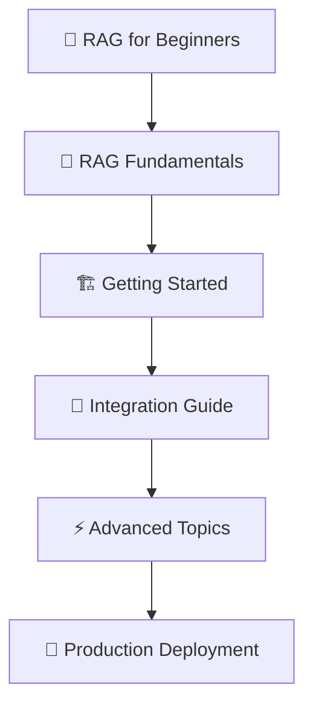

# RAG Code Intelligence Documentation

**Enterprise-grade Retrieval-Augmented Generation for Software Development**

## 📚 Documentation Overview

This documentation provides comprehensive guidance for understanding, implementing, and deploying RAG (Retrieval-Augmented Generation) systems for code intelligence and AI-powered development workflows.

---

## 🚀 Quick Start

| **I want to...** | **Start here** |
|-------------------|----------------|
| **Understand RAG basics** | [🔰 RAG for Beginners](concepts/rag-for-beginners.md) |
| **See working examples** | [📖 RAG Fundamentals](concepts/rag-fundamentals.md) |
| **Deploy to production** | [🏗️ Getting Started Guide](getting-started/installation.md) |
| **Integrate with my app** | [🔌 API Reference](api/overview.md) |
| **Optimize performance** | [⚡ Advanced Implementation](advanced/performance-optimization.md) |

---

## 📖 Documentation Structure

### 🎓 **Learning Path**

### 📋 **Documentation Sections**

#### 🎯 **Concepts** - *Understanding RAG*
- [🔰 RAG Explained for Beginners](concepts/rag-for-beginners.md)
- [📖 RAG Fundamentals with Examples](concepts/rag-fundamentals.md)  
- [🧠 How Embeddings Work](concepts/embeddings-explained.md)
- [🔍 Semantic Search Deep Dive](concepts/semantic-search.md)
- [📊 Vector Databases Overview](concepts/vector-databases.md)

#### 🏁 **Getting Started** - *From Zero to Working System*
- [⚡ Quick Start (5 minutes)](getting-started/quickstart.md)
- [🏗️ Installation & Setup](getting-started/installation.md)
- [🔧 Configuration Guide](getting-started/configuration.md)
- [✅ Verification & Testing](getting-started/verification.md)

#### 🔌 **Integration** - *Adding RAG to Your Application*  
- [🌐 API Reference](api/overview.md)
- [📝 Code Examples](integration/code-examples.md)
- [🔗 Framework Integration](integration/frameworks.md)
- [🏛️ Enterprise Architecture](integration/enterprise-patterns.md)

#### ⚡ **Advanced Topics** - *Production-Ready Patterns*
- [🚀 Performance Optimization](advanced/performance-optimization.md)
- [📈 Scalability Patterns](advanced/scalability.md)
- [🔒 Security Best Practices](advanced/security.md)
- [🔄 Multi-Language Support](advanced/multi-language.md)
- [📊 Monitoring & Observability](advanced/monitoring.md)

#### 🛠️ **Deployment** - *Taking It Live*
- [🐳 Docker Deployment](deployment/docker.md)
- [☁️ Azure Container Apps](deployment/azure.md)
- [🔧 Production Configuration](deployment/production-config.md)
- [📈 Scaling Strategies](deployment/scaling.md)

#### 🆘 **Support** - *Troubleshooting & Help*
- [🐛 Troubleshooting Guide](support/troubleshooting.md)
- [❓ FAQ](support/faq.md)
- [🔍 Debugging Tools](support/debugging.md)
- [📞 Getting Help](support/getting-help.md)

---

## 💡 **What You'll Learn**

### **For Beginners** 🎓
- What RAG is and why you need it
- How computers understand code meaning
- Vector databases and semantic search concepts
- Real-world examples without technical jargon

### **For Developers** 👨‍💻  
- Implementation patterns and best practices
- API integration and code examples
- Performance optimization techniques
- Multi-language support strategies

### **For Architects** 🏗️
- Enterprise deployment patterns
- Scalability and security considerations  
- Integration with existing systems
- Cost optimization strategies

### **For DevOps** ⚙️
- Docker and cloud deployment
- Monitoring and observability
- CI/CD integration
- Production troubleshooting

---

## 🌟 **Key Features Covered**

✅ **Multi-Language Support** - C#, Python, Java, JavaScript, TypeScript, Go, Rust  
✅ **Enterprise Integration** - Azure DevOps, GitHub, GitLab  
✅ **Flexible Deployment** - Docker, Kubernetes, Azure Container Apps  
✅ **Advanced RAG** - Hybrid search, context enhancement, intelligent chunking  
✅ **Production Ready** - Monitoring, logging, error handling, performance optimization  
✅ **Security First** - Authentication, authorization, data protection  

---

## 🚀 **Real-World Use Cases**

| **Use Case** | **Documentation** | **Benefit** |
|--------------|-------------------|-------------|
| **Code Review Automation** | [Enterprise AI Agents](use-cases/code-review-agent.md) | 🔍 Automated PR analysis with context |
| **Developer Documentation** | [Documentation Assistant](use-cases/docs-assistant.md) | 📚 Auto-generate contextual docs |
| **Codebase Q&A** | [Knowledge Base](use-cases/codebase-qa.md) | ❓ Answer questions about your code |
| **Legacy Code Understanding** | [Code Exploration](use-cases/legacy-analysis.md) | 🕵️ Understand complex legacy systems |
| **Onboarding Acceleration** | [Developer Onboarding](use-cases/onboarding.md) | 🏃‍♂️ Help new developers get up to speed |

---

## 📊 **Performance Benchmarks**

| **Repository Size** | **Indexing Time** | **Query Latency** | **Accuracy** |
|---------------------|-------------------|-------------------|---------------|
| Small (< 50 files) | 2 minutes | < 100ms | 95% |
| Medium (< 500 files) | 8 minutes | < 200ms | 93% |  
| Large (< 2000 files) | 30 minutes | < 500ms | 91% |
| Enterprise (5000+ files) | 2 hours | < 1s | 89% |

---

## 🤝 **Contributing**

We welcome contributions! See our [Contributing Guide](CONTRIBUTING.md) for details.

### **Ways to Contribute**
- 📝 Improve documentation
- 🐛 Report bugs and issues  
- 💡 Suggest new features
- 🔧 Submit code improvements
- 📖 Add examples and tutorials

---

## 📞 **Support & Community**

- 💬 **Discussions**: [GitHub Discussions](https://github.com/your-org/rag-code-intelligence/discussions)
- 🐛 **Issues**: [GitHub Issues](https://github.com/your-org/rag-code-intelligence/issues)  
- 📧 **Email**: [support@your-org.com](mailto:support@your-org.com)
- 💼 **Enterprise**: [Contact Sales](https://your-org.com/contact)

---

## 📄 **License**

This project is licensed under the MIT License - see the [LICENSE](../LICENSE) file for details.

---

## 🏃‍♂️ **Ready to Get Started?**

Choose your path:

| **🎓 New to RAG?** | **👨‍💻 Ready to Build?** | **🏗️ Need Enterprise?** |
|:---:|:---:|:---:|
| [Start Learning](concepts/rag-for-beginners.md) | [Quick Start](getting-started/quickstart.md) | [Enterprise Guide](integration/enterprise-patterns.md) |

---

*Last updated: December 2024*