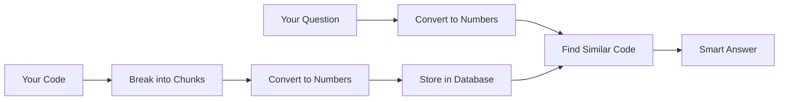

# 🔰 RAG Explained for Complete Beginners

*This is the official documentation version of our beginner's guide*

## Quick Navigation

- 📖 **[Complete Beginner's Guide](../../rag-explained-for-beginners.md)** - Full article with examples
- ⚡ **[Quick Start](../getting-started/quickstart.md)** - Get running in 5 minutes  
- 🏗️ **[Implementation Guide](rag-fundamentals.md)** - Step-by-step with code

---

## What is RAG?

**RAG (Retrieval-Augmented Generation)** makes AI smarter by letting it search through your actual codebase before answering questions.

### The Problem RAG Solves

**Without RAG:**
```
👤 You: "How do I authenticate users in my app?"
🤖 AI: "Here's how to do authentication in general..."
```

**With RAG:**
```
👤 You: "How do I authenticate users in my app?" 
🔍 RAG: *searches your actual code*
🤖 AI: "Looking at your AuthService.cs, you can use the ValidateUser() method on line 47..."
```

## How It Works (Simple Version)



## Key Concepts

### 🧭 **Vectors**
Think of vectors like GPS coordinates, but for meaning instead of location.

### 📦 **Chunks**  
Your code files get broken into smaller, digestible pieces.

### 🔍 **Embeddings**
How we convert code into numbers that capture meaning.

### 🗄️ **Vector Database**
A smart filing cabinet that organizes code by meaning, not alphabetically.

---

## Why Your Team Needs RAG

✅ **Faster Onboarding** - New developers understand your codebase instantly  
✅ **Better Code Reviews** - AI understands your patterns and conventions  
✅ **Reduced Context Switching** - Get answers without digging through files  
✅ **Legacy Code Understanding** - Make sense of complex, undocumented systems  
✅ **Consistent Architecture** - AI suggestions follow your existing patterns  

---

## Real-World Examples

### Code Q&A
**Query:** "How do I add a new API endpoint?"  
**RAG Response:** *Shows your existing controller patterns, authentication middleware, and validation examples*

### Code Review Assistant  
**Pull Request:** New authentication method  
**RAG Analysis:** *Compares with existing auth patterns, suggests improvements based on your security standards*

### Documentation Helper
**Need:** Generate API documentation  
**RAG Output:** *Creates docs that match your existing style and includes actual usage examples from your code*

---

## Next Steps

### 🎓 **Learning Path**
1. **You are here** - Understanding the basics
2. [📖 RAG Fundamentals](rag-fundamentals.md) - See it implemented
3. [⚡ Quick Start](../getting-started/quickstart.md) - Try it yourself
4. [🏗️ Production Deployment](../deployment/docker.md) - Take it live

### 🛠️ **Implementation Options**
- **Cloud-First:** [Azure Container Apps](../deployment/azure.md)
- **Self-Hosted:** [Docker Deployment](../deployment/docker.md)  
- **Enterprise:** [Enterprise Architecture](../integration/enterprise-patterns.md)

### 📚 **Deep Dives**
- [🧠 How Embeddings Work](embeddings-explained.md)
- [🔍 Semantic Search Deep Dive](semantic-search.md)
- [⚡ Performance Optimization](../advanced/performance-optimization.md)

---

## FAQ

**Q: Will this work with my programming language?**  
A: Yes! RAG works with any programming language - C#, Python, Java, JavaScript, Go, Rust, etc.

**Q: How much does it cost to run?**  
A: Indexing a typical repository (500 files) costs ~$2-5. Queries cost ~$0.001 each.

**Q: How long does indexing take?**  
A: Small repos (50 files): 2-5 minutes. Large repos (1000+ files): 30-60 minutes.

**Q: Does it store my code externally?**  
A: No, your code stays on your infrastructure. Only mathematical vectors are processed by AI services.

**Q: Can it replace documentation?**  
A: It complements documentation by making it searchable and providing context-aware answers.

---

**Ready to dive deeper?** Read the [complete beginner's guide](../../rag-explained-for-beginners.md) with detailed examples and visual explanations.