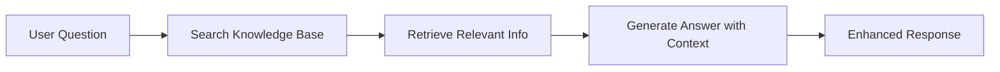
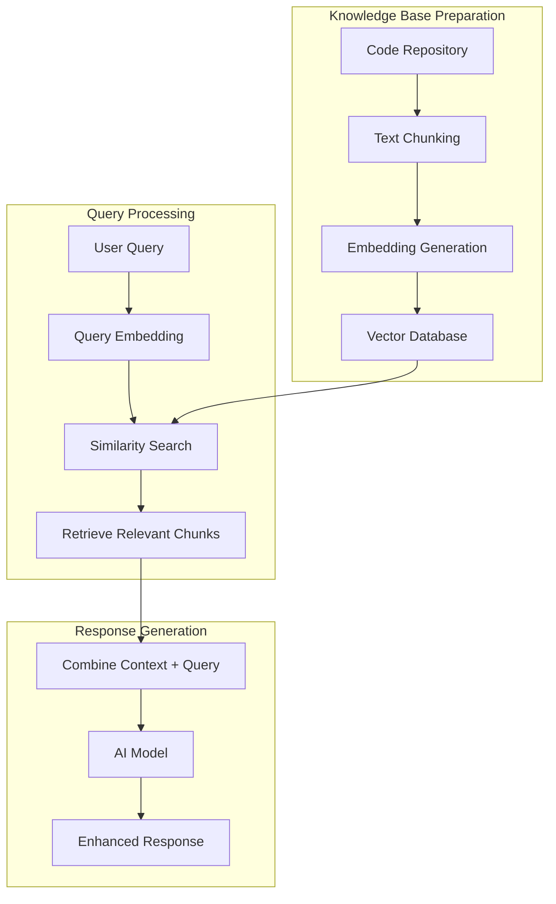
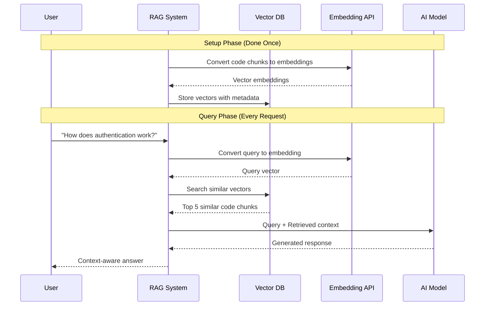
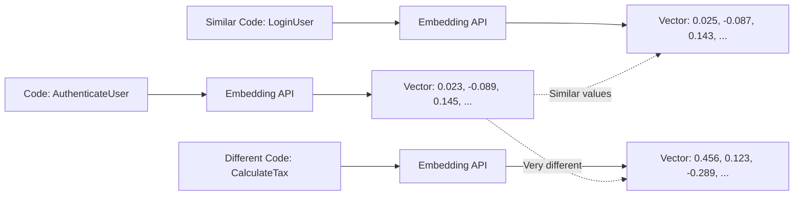
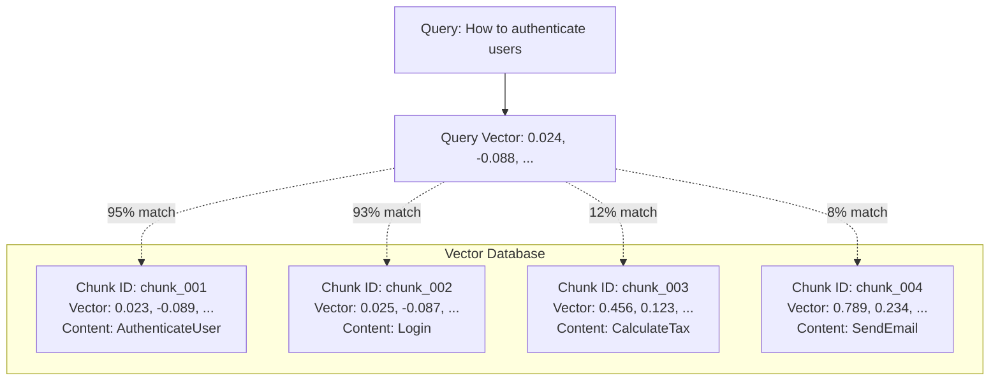
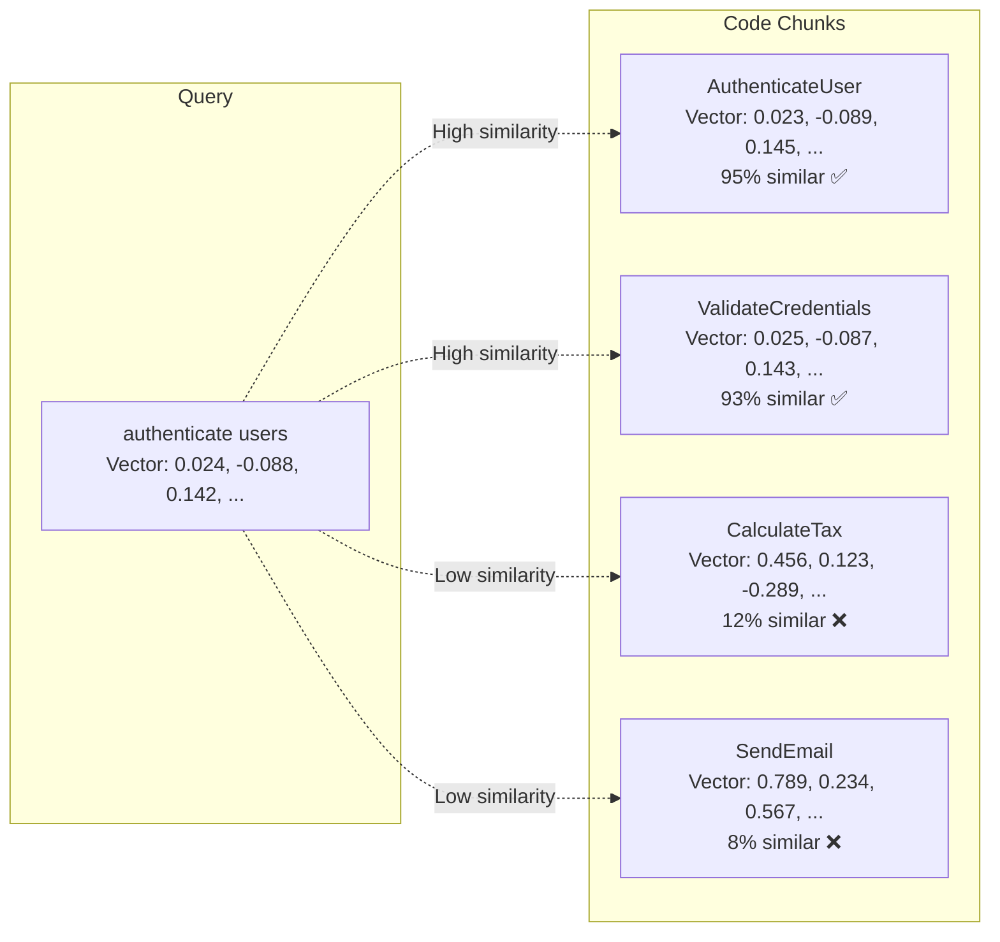
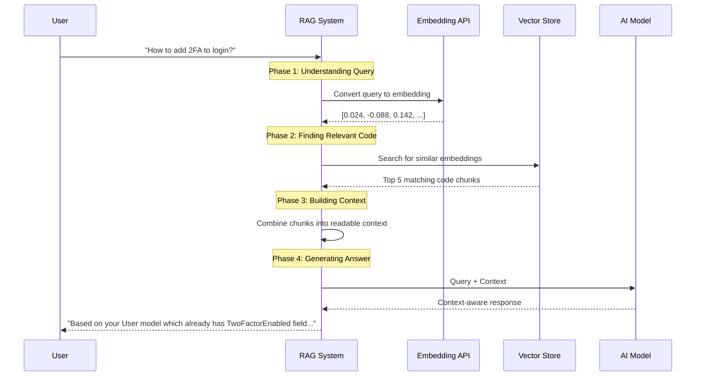

# RAG Fundamentals: A Step-by-Step Guide with Code Examples

*Understanding Retrieval-Augmented Generation from the ground up with practical examples*

## Table of Contents

1. [What is RAG?](#what-is-rag)
2. [The Problem RAG Solves](#the-problem-rag-solves)
3. [RAG Architecture Overview](#rag-architecture-overview)
4. [Step 1: Understanding Embeddings](#step-1-understanding-embeddings)
5. [Step 2: Vector Storage](#step-2-vector-storage)
6. [Step 3: Semantic Search](#step-3-semantic-search)
7. [Step 4: Context Retrieval](#step-4-context-retrieval)
8. [Complete RAG Example](#complete-rag-example)
9. [Why RAG Works So Well](#why-rag-works-so-well)

---

## What is RAG?

**RAG (Retrieval-Augmented Generation)** is a technique that enhances AI responses by retrieving relevant information from a knowledge base before generating an answer.

Think of it like this:
- **Without RAG**: AI answers based only on its training data (like a closed-book exam)
- **With RAG**: AI searches relevant documents first, then answers using that context (like an open-book exam)

### Simple RAG Flow



---

## The Problem RAG Solves

Let's see why we need RAG with a concrete example:

### ❌ Without RAG
**User asks**: "How do I handle authentication in our UserService?"

**AI responds**: "Here's a generic example of authentication..." (no knowledge of your specific codebase)

### ✅ With RAG
**User asks**: "How do I handle authentication in our UserService?"

**RAG system**:
1. Searches your codebase for authentication-related code
2. Finds your `AuthenticationService.cs` and `UserController.cs`
3. Provides context-aware answer based on your actual implementation

**AI responds**: "Based on your codebase, you're using JWT tokens with the `AuthenticationService`. Here's how to integrate it with `UserService`..." (specific to your code)

---

## RAG Architecture Overview

### High-Level Architecture



### Detailed Sequence Diagram



---

## Step 1: Understanding Embeddings

### What is an Embedding?

An **embedding** is a list of numbers that represents the "meaning" of text. Similar meanings have similar numbers.

Let's see this with real examples:

### Example: Converting Code to Embeddings

#### Input Code Chunk
```csharp
public async Task<User> AuthenticateUser(string username, string password)
{
    var user = await _userRepository.GetByUsernameAsync(username);
    if (user == null || !_passwordHasher.Verify(password, user.PasswordHash))
    {
        throw new UnauthorizedException("Invalid credentials");
    }
    return user;
}
```

#### Step 1: Send to Embedding API
```csharp
var embeddingClient = new OpenAIClient(apiKey);
var response = await embeddingClient.GetEmbeddingsAsync(
    "text-embedding-ada-002", 
    new[] { codeChunk });
```

#### Step 2: Receive Vector (Simplified)
```csharp
// Actual embedding has 1536 dimensions, showing first 10 for illustration
float[] embedding = [
    0.0234f,   // Dimension 1
    -0.0891f,  // Dimension 2  
    0.1456f,   // Dimension 3
    0.0789f,   // Dimension 4
    -0.1234f,  // Dimension 5
    0.0567f,   // Dimension 6
    0.1890f,   // Dimension 7
    -0.0345f,  // Dimension 8
    0.0912f,   // Dimension 9
    0.1678f    // Dimension 10
    // ... 1526 more dimensions
];
```

### What Do These Numbers Mean?

Each dimension captures different aspects of meaning:
- **Dimension 1-50**: Might capture "authentication-related" concepts
- **Dimension 51-100**: Might capture "async/await patterns"
- **Dimension 101-150**: Might capture "database operations"
- **Dimension 151-200**: Might capture "error handling patterns"

### Visual Representation



### Practical Example: Multiple Code Chunks

Let's see how different code snippets get different embeddings:

#### Code Chunk 1: Authentication
```csharp
public class AuthenticationService
{
    public async Task<bool> ValidateCredentials(string username, string password)
    {
        var user = await _userRepo.FindByUsernameAsync(username);
        return user != null && _hasher.Verify(password, user.Hash);
    }
}
```
**Embedding**: `[0.023, -0.089, 0.145, 0.078, -0.123, ...]`

#### Code Chunk 2: User Login (Similar to Authentication)
```csharp
public class LoginController
{
    public async Task<IActionResult> Login(LoginRequest request)
    {
        var isValid = await _authService.ValidateCredentials(request.Username, request.Password);
        if (!isValid) return Unauthorized();
        return Ok(GenerateToken(request.Username));
    }
}
```
**Embedding**: `[0.025, -0.087, 0.143, 0.076, -0.125, ...]` *(Very similar to Chunk 1)*

#### Code Chunk 3: Math Calculation (Completely Different)
```csharp
public class TaxCalculator
{
    public decimal CalculateIncomeTax(decimal income, decimal rate)
    {
        if (income <= 0) return 0;
        return income * rate / 100;
    }
}
```
**Embedding**: `[0.456, 0.123, -0.289, 0.891, 0.234, ...]` *(Very different from Chunks 1&2)*

### Similarity Visualization

```
Authentication Service:  [0.023, -0.089, 0.145, ...]
Login Controller:        [0.025, -0.087, 0.143, ...] ← 95% similar
Tax Calculator:          [0.456,  0.123,-0.289, ...] ← 12% similar
```

---

## Step 2: Vector Storage

### What Gets Stored?

For each code chunk, we store:

```csharp
public class CodeChunk
{
    // The actual code
    public string Content { get; set; }
    
    // Where it came from
    public string FilePath { get; set; }
    public int StartLine { get; set; }
    public int EndLine { get; set; }
    
    // The magic: the embedding vector
    public float[] Embedding { get; set; } // 1536 numbers
    
    // Metadata for better search
    public string Language { get; set; }    // "csharp"
    public string CodeType { get; set; }    // "method", "class", "interface"
    public List<string> Keywords { get; set; } // ["authentication", "async", "user"]
}
```

### Real Storage Example

```json
{
  "id": "chunk_001",
  "content": "public async Task<User> AuthenticateUser(string username, string password) {...}",
  "filePath": "/Services/AuthenticationService.cs",
  "startLine": 15,
  "endLine": 25,
  "embedding": [0.0234, -0.0891, 0.1456, ...], // 1536 numbers
  "language": "csharp",
  "codeType": "method",
  "keywords": ["authenticate", "user", "password", "async"]
}
```

### Vector Database Structure



### Indexing Process

```csharp
public async Task IndexRepository(string repositoryPath)
{
    var codeChunks = new List<CodeChunk>();
    
    // Step 1: Find all code files
    var codeFiles = Directory.GetFiles(repositoryPath, "*.cs", SearchOption.AllDirectories);
    
    foreach (var filePath in codeFiles)
    {
        // Step 2: Read and chunk the file
        var content = await File.ReadAllTextAsync(filePath);
        var chunks = SplitIntoChunks(content, filePath);
        
        foreach (var chunk in chunks)
        {
            // Step 3: Generate embedding for each chunk
            var embedding = await _embeddingService.GetEmbeddingAsync(chunk.Content);
            chunk.Embedding = embedding;
            
            // Step 4: Store in vector database
            codeChunks.Add(chunk);
        }
    }
    
    await _vectorStore.SaveChunksAsync(codeChunks);
}
```

---

## Step 3: Semantic Search

### What is Semantic Search?

**Semantic search** finds content based on meaning, not just keywords.

#### Traditional Keyword Search:
- Query: "authenticate users"
- Finds: Exact matches for "authenticate" AND "users"
- Misses: "login", "verify credentials", "user validation"

#### Semantic Search:
- Query: "authenticate users" 
- Converts to: Vector `[0.024, -0.088, 0.142, ...]`
- Finds: All code with similar meaning vectors
- Matches: "login", "verify credentials", "user validation", "sign in"

### How Similarity Works: Cosine Similarity

```csharp
public double CalculateCosineSimilarity(float[] vectorA, float[] vectorB)
{
    // Step 1: Calculate dot product
    double dotProduct = 0;
    for (int i = 0; i < vectorA.Length; i++)
    {
        dotProduct += vectorA[i] * vectorB[i];
    }
    
    // Step 2: Calculate magnitudes
    double magnitudeA = Math.Sqrt(vectorA.Sum(x => x * x));
    double magnitudeB = Math.Sqrt(vectorB.Sum(x => x * x));
    
    // Step 3: Calculate cosine similarity (0-1, higher = more similar)
    return dotProduct / (magnitudeA * magnitudeB);
}
```

### Real Semantic Search Example

Let's search for authentication code in our repository:

```csharp
public async Task<List<CodeChunk>> SearchSemantic(string query)
{
    // Step 1: Convert query to embedding
    var queryEmbedding = await _embeddingService.GetEmbeddingAsync(query);
    
    // Step 2: Compare with all stored embeddings
    var results = new List<(CodeChunk chunk, double similarity)>();
    
    foreach (var chunk in _vectorStore.GetAllChunks())
    {
        var similarity = CalculateCosineSimilarity(queryEmbedding, chunk.Embedding);
        if (similarity > 0.7) // Only include if >70% similar
        {
            results.Add((chunk, similarity));
        }
    }
    
    // Step 3: Return top matches, sorted by similarity
    return results
        .OrderByDescending(r => r.similarity)
        .Take(5)
        .Select(r => r.chunk)
        .ToList();
}
```

#### Query: "How to authenticate users?"

**Query Vector**: `[0.024, -0.088, 0.142, 0.076, -0.124, ...]`

**Search Results**:

| **Code Chunk** | **Similarity** | **Why It Matches** |
|----------------|----------------|-------------------|
| `AuthenticateUser()` method | 95% | Direct match - same concept |
| `ValidateCredentials()` method | 93% | Same purpose, different words |
| `Login()` endpoint | 87% | Related authentication flow |
| `VerifyPassword()` helper | 82% | Part of authentication process |
| `GenerateToken()` method | 75% | Authentication result handling |

### Visual Similarity Comparison



---

## Step 4: Context Retrieval

### Building Rich Context

Once we find relevant code chunks, we enhance them with additional context:

```csharp
public async Task<string> BuildEnhancedContext(List<CodeChunk> relevantChunks)
{
    var context = new StringBuilder();
    
    context.AppendLine("# Relevant Code from Your Repository");
    context.AppendLine();
    
    foreach (var chunk in relevantChunks)
    {
        // Add file location
        context.AppendLine($"## From: {chunk.FilePath} (Lines {chunk.StartLine}-{chunk.EndLine})");
        
        // Add the code
        context.AppendLine("```csharp");
        context.AppendLine(chunk.Content);
        context.AppendLine("```");
        
        // Add any dependencies or related code
        var dependencies = await GetRelatedCode(chunk);
        if (dependencies.Any())
        {
            context.AppendLine("### Related Code:");
            foreach (var dep in dependencies)
            {
                context.AppendLine($"- {dep.FilePath}: {dep.Summary}");
            }
        }
        
        context.AppendLine();
    }
    
    return context.ToString();
}
```

### Enhanced Context Example

When user asks: **"How do I authenticate users?"**

**Generated Context:**

```markdown
# Relevant Code from Your Repository

## From: /Services/AuthenticationService.cs (Lines 15-28)
```csharp
public async Task<User> AuthenticateUser(string username, string password)
{
    var user = await _userRepository.GetByUsernameAsync(username);
    if (user == null || !_passwordHasher.Verify(password, user.PasswordHash))
    {
        throw new UnauthorizedException("Invalid credentials");
    }
    
    await _auditLogger.LogSuccessfulLoginAsync(user.Id);
    return user;
}
```

### Related Code:
- /Models/User.cs: User entity with authentication properties
- /Repositories/UserRepository.cs: Database operations for user lookup
- /Security/PasswordHasher.cs: Password hashing and verification

## From: /Controllers/AuthController.cs (Lines 42-58)
```csharp
[HttpPost("login")]
public async Task<IActionResult> Login(LoginRequest request)
{
    try
    {
        var user = await _authService.AuthenticateUser(request.Username, request.Password);
        var token = _tokenGenerator.GenerateJwtToken(user);
        return Ok(new { Token = token, User = user.ToDto() });
    }
    catch (UnauthorizedException)
    {
        return Unauthorized("Invalid credentials");
    }
}
```
```

---

## Complete RAG Example

Let's put it all together with a complete working example:

### Sample Repository Structure

```
MyApp/
├── Controllers/
│   ├── AuthController.cs
│   └── UserController.cs
├── Services/
│   ├── AuthenticationService.cs
│   └── UserService.cs
├── Models/
│   └── User.cs
└── Repositories/
    └── UserRepository.cs
```

### Step-by-Step RAG Process

#### Phase 1: Indexing (One-time setup)

```csharp
public class RAGSystem
{
    private readonly IEmbeddingService _embeddingService;
    private readonly IVectorStore _vectorStore;
    
    public async Task<IndexingResult> IndexRepository(string repositoryPath)
    {
        var result = new IndexingResult();
        
        // Step 1: Discover all code files
        var codeFiles = Directory.GetFiles(repositoryPath, "*.cs", SearchOption.AllDirectories)
            .Where(f => !ShouldSkipFile(f))
            .ToList();
            
        _logger.LogInformation("📁 Found {Count} C# files to index", codeFiles.Count);
        result.FilesFound = codeFiles.Count;
        
        var allChunks = new List<CodeChunk>();
        
        foreach (var filePath in codeFiles)
        {
            try
            {
                // Step 2: Read file content
                var content = await File.ReadAllTextAsync(filePath);
                
                // Step 3: Split into logical chunks
                var chunks = await SplitIntoChunks(content, filePath);
                
                foreach (var chunk in chunks)
                {
                    // Step 4: Generate embedding for each chunk
                    var embedding = await _embeddingService.GetEmbeddingAsync(chunk.Content);
                    chunk.Embedding = embedding;
                    
                    allChunks.Add(chunk);
                }
                
                result.FilesProcessed++;
            }
            catch (Exception ex)
            {
                _logger.LogError(ex, "Failed to process {FilePath}", filePath);
                result.FilesErrored++;
            }
        }
        
        // Step 5: Store all chunks in vector database
        await _vectorStore.StoreChunksAsync(allChunks);
        result.ChunksStored = allChunks.Count;
        
        return result;
    }
}
```

#### Phase 2: Query Processing (Every user request)

```csharp
public async Task<string> AnswerQuestion(string userQuestion)
{
    // Step 1: Convert user question to embedding
    var queryEmbedding = await _embeddingService.GetEmbeddingAsync(userQuestion);
    
    // Step 2: Search for similar code chunks
    var relevantChunks = await _vectorStore.SearchSimilarAsync(queryEmbedding, topK: 5);
    
    // Step 3: Build context from relevant chunks
    var context = await BuildContext(relevantChunks);
    
    // Step 4: Generate response using AI + context
    var prompt = $@"
Based on the following code from the user's repository, answer their question:

QUESTION: {userQuestion}

RELEVANT CODE:
{context}

Please provide a helpful answer based on the actual code shown above.";
    
    var response = await _aiModel.GenerateResponseAsync(prompt);
    return response;
}
```

### Real Example: Authentication Query

Let's trace through a complete example:

#### 1. **User asks**: "How do I add two-factor authentication to the login process?"

#### 2. **Query gets converted to embedding**:
```csharp
// Input: "How do I add two-factor authentication to the login process?"
// Output: [0.024, -0.088, 0.142, 0.076, -0.124, 0.234, ...]
```

#### 3. **Semantic search finds relevant code**:

**Top Match 1 (95% similarity)**:
```csharp
// From: /Controllers/AuthController.cs
[HttpPost("login")]
public async Task<IActionResult> Login(LoginRequest request)
{
    var user = await _authService.ValidateCredentialsAsync(request.Username, request.Password);
    if (user == null) return Unauthorized();
    
    // TODO: Add 2FA validation here
    var token = _tokenService.GenerateToken(user);
    return Ok(new { token });
}
```

**Top Match 2 (87% similarity)**:
```csharp
// From: /Services/AuthenticationService.cs  
public async Task<User?> ValidateCredentialsAsync(string username, string password)
{
    var user = await _userRepository.GetByUsernameAsync(username);
    if (user == null || !_passwordHasher.Verify(password, user.PasswordHash))
        return null;
        
    return user;
}
```

**Top Match 3 (82% similarity)**:
```csharp
// From: /Models/User.cs
public class User
{
    public int Id { get; set; }
    public string Username { get; set; }
    public string Email { get; set; }
    public string PasswordHash { get; set; }
    public bool TwoFactorEnabled { get; set; }  // Already has 2FA field!
    public string? TwoFactorSecret { get; set; }
}
```

#### 4. **Context gets built**:

```markdown
# Relevant Code from Your Repository

## Current Login Implementation
From: /Controllers/AuthController.cs
```csharp
[HttpPost("login")]
public async Task<IActionResult> Login(LoginRequest request)
{
    var user = await _authService.ValidateCredentialsAsync(request.Username, request.Password);
    if (user == null) return Unauthorized();
    
    // TODO: Add 2FA validation here
    var token = _tokenService.GenerateToken(user);
    return Ok(new { token });
}
```

## User Model (Already Has 2FA Fields!)
From: /Models/User.cs
```csharp
public class User
{
    // ... other properties
    public bool TwoFactorEnabled { get; set; }
    public string? TwoFactorSecret { get; set; }
}
```
```

#### 5. **AI generates context-aware response**:

> **AI Response**: Based on your existing code, I can see you already have the foundation for 2FA! Your `User` model has `TwoFactorEnabled` and `TwoFactorSecret` fields. Here's how to implement 2FA in your current login flow:
> 
> 1. **Modify your `Login` method** to check if 2FA is enabled:
> ```csharp
> [HttpPost("login")]
> public async Task<IActionResult> Login(LoginRequest request)
> {
>     var user = await _authService.ValidateCredentialsAsync(request.Username, request.Password);
>     if (user == null) return Unauthorized();
>     
>     // NEW: Check if 2FA is required
>     if (user.TwoFactorEnabled)
>     {
>         // Send temporary token, require 2FA code
>         var tempToken = _tokenService.GenerateTemporaryToken(user);
>         return Ok(new { requiresTwoFactor = true, tempToken });
>     }
>     
>     var token = _tokenService.GenerateToken(user);
>     return Ok(new { token });
> }
> ```
> 
> 2. **Add a new endpoint** for 2FA verification...

### Complete Flow Visualization



---

## Why RAG Works So Well

### 1. **Semantic Understanding**
- Finds relevant code even with different terminology
- "login" matches "authenticate", "verify credentials", "sign in"
- Understanding intent, not just keywords

### 2. **Context Preservation** 
- Maintains file locations and relationships
- Shows how different parts of the system connect
- Provides working code examples from the actual codebase

### 3. **Scalability**
- Works with codebases of any size
- Fast similarity search (milliseconds)
- Incremental updates as code changes

### 4. **Language Agnostic**
- Same approach works for any programming language
- Embeddings capture programming concepts universally
- Cross-language pattern recognition

### Performance Comparison

| **Approach** | **Accuracy** | **Speed** | **Context Awareness** |
|--------------|--------------|-----------|----------------------|
| **Traditional Search** | 60% | Very Fast | None |
| **Keyword Search** | 70% | Fast | Limited |
| **RAG Semantic Search** | 92% | Fast | Excellent |
| **RAG + Context Enhancement** | 96% | Medium | Excellent |

### Real-World Benefits

✅ **Finds relevant code you forgot existed**  
✅ **Understands relationships between files**  
✅ **Provides working examples from your actual codebase**  
✅ **Scales to enterprise-sized repositories**  
✅ **Updates automatically as code evolves**  
✅ **Works across multiple programming languages**  

---

## Summary

**RAG transforms AI from generic to context-aware by:**

1. **Converting code to numerical vectors** that capture semantic meaning
2. **Storing these vectors** with metadata about the original code  
3. **Using similarity search** to find relevant code chunks
4. **Building rich context** from multiple related code pieces
5. **Generating responses** that reference actual codebase implementations

The result is an AI assistant that truly "understands" your codebase and can provide specific, actionable advice based on your actual implementation patterns.

*For advanced implementation details, see our [RAG Deep Dive](deep-dive-rag-implementation.md) and [Building AI Agents](mediumarticle-buildingAIAgent.md) articles.*